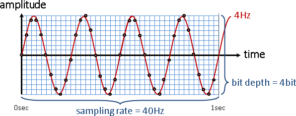
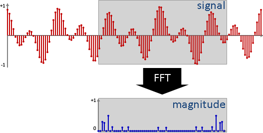

# 频谱实现

​	要让电脑处理声音，必须预先让声音变成数字，也就是让声音经过「取样sampling 」与「量化quantization 」两个步骤。取样把时间变成离散，量化把振幅变成离散。

​	先取样（得到数列），再量化（四舍五入），最后得到一串整数数列。每个数字称作「样本sample 」或「信号signal 」。



​	所以想要对音乐文件进行处理，我们首先要得到音乐文件的源数据（raw data），这里需要说明的是，我一开始使用的VLC-QT这个第三方库进行代码的编写，频谱图是我最后一个需要实现的功能，遗憾的是，当我查看VLC-QT官方文档的时候，发现作者并没有写音频源数据的接口，所以如果想要实现这个功能，只能采取折中的方法，当用户播放MP3文件的时候，采用Qt 的Multimedia这个类进行解码，这样就可以得到音频源数据了，由于调用的是两个不同的库，并且时间关系，我没有对这个进行完善，播放频谱的时候，无法进行进度条等的控制。


「取样sampling 」与「量化quantization 」的关键参数：

duration 持续时间：声音总共多少秒。数值越高，信号越多。

sampling rate 取样频率：一秒钟有多少个信号。数值越高，音质越好。电脑的声音档案，通常采用48000Hz 或44100Hz 。手机与电话的声音传输，公定为8000Hz 。

bit depth 位元深度：一个讯号用多少个位元记录。数值越高，音质越好。电脑的声音档案，通常采用16-bit 或24-bit 。16-bit 的每个信号是[-32768,+32767] 的整数，符合C 语言的short 变数。

channel 声道：同时播放的声音信号总共几条。每一条声音讯号都是一样长。举例来说，民众所熟悉的双声道，其实就是同时播出两条不同的声音信号（左右声道）。

取样频率、持续时间、声道，相乘之后就是讯号数量。再乘以位元深度，就是容量大小。再除以8 ，可将单位换成byte 。

以上这些都是有关声音的一些术语知识。

我们刚才提过，想要绘制频谱图，必须得到源数据，我们使用的是Qt multimedia类提供的API来获取源数据，现在数据有了，我们还需要做的就是将源数据（音频信号）进行处理。

振动十分复杂，难以测量频率。我们需要使用快速傅里叶变换（Fast Fourier Transform）简称FFT，将信号数值分解成简谐波，解析频率。




spectrum 频谱：一个特定时间点的频率分布图。

 

得出频谱图的做法是：截取一小段时间范围的信号，实施快速傅立叶转换，得到每一种频率的波的振幅（magnitude）。

根据取样定理，我们只要处理一半的信号就够了，实际上这个播放器实现的代码也是只取了前一半。

那么怎么使用FFT呢？我们当然可以自己实现，但是由于我从来没有学过快速傅里叶变换，并且过于复杂，时间也不允许，所以我采用的是网上开源的kissFFT库进行FFT运算，虽然读者可以自行实现，但是除非你自己为了验证你的能力，或为了验证你对对快速傅里叶变换算法的了解，千万别用自己写的快速傅里叶变换算法，也别在网上随便找一个算法就拿来用，因为很难验证自己处理好的数据是否正确，而且速度很难达到预期。

现在我们知道可以通过FFT来处理音频信号数据，那么FFT之后，得到的是什么呢？

FFT之后得到的那一串复数是波形对应频率下的幅度特征，下面要讲两个问题：1.如何获取频率，2.如何获取幅值

FFT变换如何获取频率？傅里叶变换并没对频率进行任何计算，频率只与采样率和进行傅里叶变换的点数相关，注意这里是进行傅里叶变换的点数而不一定是信号的长度。 

FFT变换完第一个数时0Hz频率，0Hz就是没有波动，没有波动有个专业一点的说法，叫直流分量。 所以在接下来的绘制的过程中，我们会跳过这个频率。

后面第二个复数对应的频率是0Hz+频谱分辨率，每隔一个加一次，频谱分辨率 Δf 计算公式如下： 

Δf=FsN

式中： 

Fs为采样率 

N为FFT的点数 

因此只要Fs和N定了，频域就定下来了。

现在我们有了幅度和频率，当然就可一来画频谱图了，当然读者也可以通过幅度得出幅值、功率来画，我这里采用的是幅度。

先定义好窗函数：

```c++
SpectrumAnalyzer::SpectrumAnalyzer(QObject *parent) : QObject(parent)
{
    m_fft = nullptr;
    for (int i = 0; i < numSamples; i++) {
        float window = 0.5f * float(1 - qCos((2 * M_PI * i) / (numSamples - 1)));
        m_window.push_back(window);
    }
    qDebug() << "contructed!";
}
```

接着使用窗函数和FFT对信号进行处理：

```c++
void SpectrumAnalyzer::calculateSpectrum(QAudioBuffer buf)
{
    int sampleRate = buf.format().sampleRate();
    QAudioBuffer :: S16S * samples = buf.data<QAudioBuffer :: S16S>();
    m_spectrum.clear();
    QVector<SpectrumStruct> pNullVector;
    m_spectrum.swap(pNullVector);

    kiss_fft_cpx inbuf[numSamples];
    kiss_fft_cpx outbuf[numSamples];

    // Initialize data array
    for (int i = 0; i < numSamples; i++) {
        float realSample = samples[i].right;
        float window = m_window[i];
        float windowedSample = realSample * window;
        inbuf[i].r = windowedSample;
        inbuf[i].i = 0;
    }

    // Calculate the FFT
    m_fft = kiss_fft_alloc(numSamples, 0, nullptr, nullptr);
    kiss_fft(m_fft, inbuf, outbuf);

    // Analyze output to obtain amplitude and phase for each frequency
    for (int i = 2; i <= numSamples / 2; i++) {
        // Calculate frequency of this complex sample
        struct SpectrumStruct thisSP;
        thisSP.frequency = float(i * sampleRate / numSamples);
        kiss_fft_cpx cpx = outbuf[i];
        float real = cpx.r;
        float imag = 0;
        if (i > 0 && i < numSamples / 2) {
            kiss_fft_cpx cpx = outbuf[numSamples / 2 + i];
            imag = cpx.r;
        }

        const float thisMagnitude = float(qSqrt(qreal(real * real + imag * imag)));
        float thisAmplitude = SpectrumAnalyserMultiplier * float(qLn(qreal(thisMagnitude)));
        qDebug() << thisSP.frequency << "\t" << thisAmplitude;
        thisSP.amplitude = thisAmplitude;
        m_spectrum.push_back(thisSP);
    }
    emit spectrumChanged(m_spectrum);}
```

现在我们得到了一个存储频谱结构体的QVector，根据这个，画出频谱图，需要注意的是，**由于我们重写了repaint事件，所以我们在用定时器连接的时候，需要使用cast造型。**

```c++
BarsWidget::BarsWidget(QWidget *parent) : QWidget(parent)
{
    m_bars.resize(barscount);
    QTimer *timer = new QTimer(this);
    connect(timer, &QTimer::timeout, this, static_cast<void (BarsWidget::*)()>(&BarsWidget::repaint));
    timer->start(50);
    m_timer_clear = new QTimer(this);
    connect(m_timer_clear, &QTimer::timeout, this, &BarsWidget::clear);
    m_timer_clear->setInterval(250);
    m_timer_clear->start();
}

	void BarsWidget::paintEvent(QPaintEvent *event)
{
    Q_UNUSED(event)

    calculate();

    float w = float(qFloor(width() / qreal(barscount) - 1));

//    float h = height();
    float h = 150.0;
    QPainter painter(this);
    painter.fillRect(rect(), Qt::black);
    int pos = int(width() - ((w + 1) * barscount)) / 2 + 1;
    for (int i = 0; i < barscount; i++) {
        float value = m_bars[i];
//        painter.fillRect(pos, int(h - (value * h)), int(w - 2), int(value * h), Qt::yellow);
        painter.fillRect(pos, int(height() - (value * h)), int(w - 2), int(value * h), Qt::yellow);
        pos += w + 1;
    }
    m_bars.fill(0);
}
```

